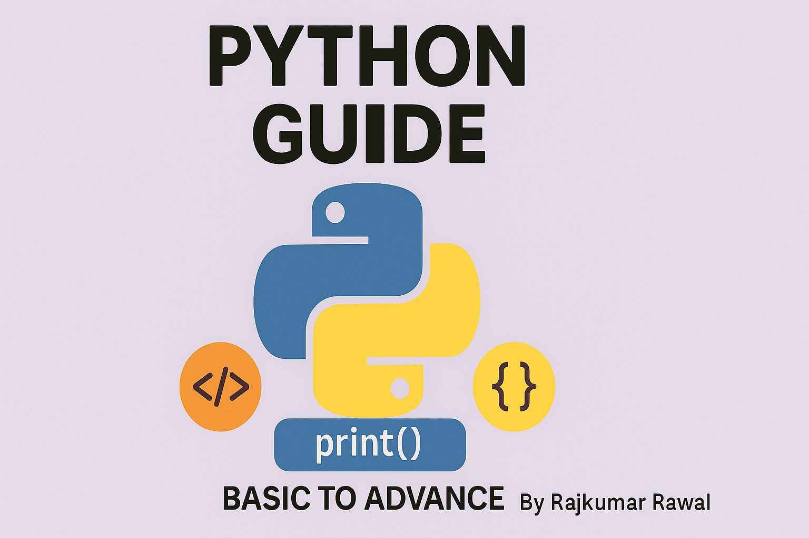

# Complete Python Basic to Advance Guide by Rajkumar Rawal [My Python Code Guide A-Z]



This Python Basic to Advanced Guide is designed to take you from the fundamentals to expert-level programming. We’ll start with core concepts like variables, data types, and control structures, then progress to more advanced topics such as object-oriented programming, file handling, and error management. The Guide also covers advanced features like decorators, generators, and working with data. Throughout, you'll engage in hands-on projects that solidify your learning and prepare you for real-world applications. By the end, you'll have the skills to build robust Python programs and tackle complex challenges with confidence.

## Table of Contents

1. [Introduction & Basics of Python](1%29%20Introduciton%20%26%20Basics%20of%20Python/)
2. [Conditional Statement in Python](2%29%20Conditional%20Statement%20in%20Python/)
3. [Pip & Modules](3%29%20Pip%20%26%20Modules/)
4. [Loops in Python](4%29%20Loops%20in%20Python/)
5. [Strings in Python](5%29%20Strings%20in%20Python%20/)
6. [Advance Python Data Types & Data Structures](6%29%20Advance%20Python%20Data%20Types%20%26%20Data%20Structures%20%3A%20/)
7. [Functions in Python](7%29%20Functions%20in%20Python/)
8. [Virtual Environment & Requirements](8%29%20Virtual%20Environment%20%26%20requirements/)
9. [File Handling in Python](9%29%20File%20Handling%20in%20Python/)
10. [Exception Handling in Python](10%29%20Exception%20Handling%20in%20Python/)
11. [Logging in Python](11%29%20Logging%20in%20Python/)
12. [Mega Projects](12%29%20Mega%20Projects/)
13. [Additional Topics](13%29%20Additional%20Topics/)
14. [Regular Expression in Python](14%29%20Regular%20Expression%20in%20Python/)
15. [Solve Day to Day Problems Using Python](15%29%20Solve%20day%20to%20day%20problems%20using%20python/)
16. [Advance Python (OOP)](16%29%20Advance%20Python%20%28OOP%29/)

## Getting Started

To get started with this  Guide, clone the repository and navigate to the desired section. Each section contains Jupyter notebooks and Python scripts that cover various topics and concepts.

```sh
git clone <repository-url>
cd <repository-directory>
```

# Contributing
Contributions are welcome! Please fork the repository and create a pull request with your changes.

# License
This project is licensed under the Apache License - see the LICENSE file for details.


